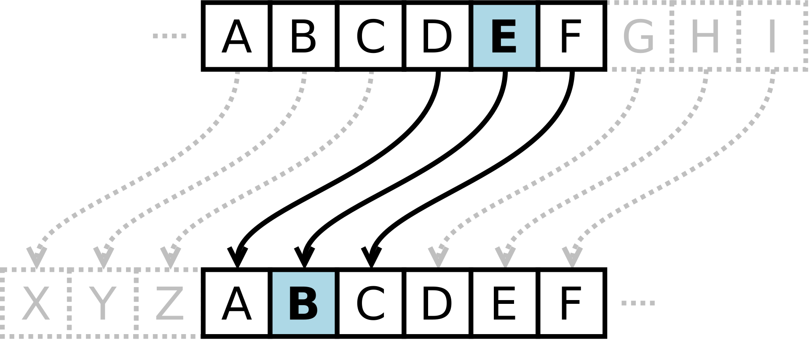

# Caesar Cipher

One of the great generals who used coded messages was Julius Caesar, around 50
BC. When Caesar sent messages to his generals, he encrypted them by shifting
the letters in the text by a fixed number of places in the alphabet. The
recipients of the message could decipher it because they knew the shift value
— while everyone else saw only meaningless text.

For example, if you wrote `NIKOLATESLA` and shifted each letter three places to
the right:

```text
A B C D E F G H I J K L M N O P Q R S T U V W X Y Z
X Y Z A B C D E F G H I J K L M N O P Q R S T U V W
```

The letter `N` becomes `K`, `I` becomes `F`, and so on. So, each letter is
replaced by another letter that is a fixed number of positions further along in
the alphabet. When the end of the alphabet is reached, the sequence continues
from the beginning. The result of the shift operation by three letters to the
right would be the encrypted message `KFHLIXQBPIX`. On the other hand, if each
letter in the resulting word were shifted three letters to the left:

```text
A B C D E F G H I J K L M N O P Q R S T U V W X Y Z
D E F G H I J K L M N O P Q R S T U V W X Y Z A B C
```

The letter `K` becomes `N`, `F` becomes `I`, and so on. The result of the shift
operation would be the original decrypted message `NIKOLATESLA`.



## Simple assignment

Create a console application in any programming language to encrypt and decrypt
messages using the Caesar cipher.

```{infonote}
First student (*the driver*) should be focused on syntax while writing the
code for message encryption. Second student (*the navigator*) should review
each line of code as it is typed, looking for the mistakes, asking questions,
and suggesting improvements. After that, the students should switch roles,
and continue with writing decryption code.
```

The allowed alphabet for messages (for plaintext and ciphertext) can include
only lowercase letters of the English alphabet:

```text
Σ = { a, b, c, d, e, f, g, h, i, j, k, l, m, n, o, p, q, r, s, t, u, v, w, x, y, z }
```

Spaces, uppercase letters, numbers, and other characters are not allowed.

In the first line of the user input there will be a message `m` no longer than
one hundred characters, in the second line there will be an integer `n` which
represents the shift value ($1 \leq n < 26$), and in the third line there will
be an integer `s`, which represents the encryption direction. If $s=1$ then `m`
should be encrypted, and if $s=2$, then `m` should be decrypted.

### Test example 1

If the input is:

```text
nikolatesla
3
1
```

the output should be:

```text
kfhlixqbpix
```

### Test example 2

If the input is:

```text
kfhlixqbpix
3
2
```

the output should be:

```text
nikolatesla
```

## Start the assignment

**---===[ EMBED OR LINK THE GRADER ]===---**

## Solution hints

Since there are 26 letters in the English alphabet, the position of each letter
can be represented by a number from 0 to 25.

* a → 0
* b → 1
* c → 2
* ...
* z → 25

To **encrypt** a letter, you can use the following formula:

```text
new_letter_position = (current_letter_position + shift_value) mod 26
```

`original_position` represents the numeric value of the letter in the alphabet,
`shift_value` represents number of positions to move (1–25), and `mod 26`
ensures that the result wraps around to the start of the alphabet if it goes
past `z`.

To **decrypt** a letter, you can use the following formula:

```text
new_letter_position = (current_letter_position - shift_value + 26) mod 26
```

Similarly like encryption, but you subtract the shift value, and `+ 26` ensures
that the value does not become negative before applying `mod 26`.

## Advanced Caesar Cipher Assignments (optional)

### Expand the allowed aplhabet

Create a console application in any programming language to encrypt and decrypt
messages using the Caesar cipher. The allowed alphabet for messages (for
plaintext and ciphertext) can include lowercase and uppercase letters of the
English alphabet, spaces, numbers, and punctuation!

The application must encrypt or decrypt only lowercase and uppercase letters.
Spaces, numbers, and punctuation marks should remain unchanged during
encryption or decryption.

In the first line of the standard input there will be a message `m` no longer
than one hundred characters, in the second line there will be an integer `n`
which represents the shift ($1 \leq n < 26$), and in the third line there will
be an integer `s`, which represents the encryption direction. If $s=1$ then `m`
should be encrypted, and if $s=2$, then `m` should be decrypted.

## Use the functions

Create two functions: one for encrypting messages and one for decrypting
messages. Use the created functions in your main program.

## Create a Class

Create a `CaesarCipher` class that contains:

* a constructor with a parameter that accepts the shift value and ensures that
the value is within the allowed range,
* a private property to store the shift value, with getter and setter methods,
* a public method to encrypt the message,
* a public method to decrypt the message, and
* optionally, include a private method to process messages, which will be used
by both encryption and decryption methods.

Use the created class in your main program.

## Accept Command Line Arguments

Instead of waiting for the user input, create a console application that
accepts the following command line arguments:

1. argument `m` for specifying the message,
2. argument `n` for specifying the shift value (`0` to `25`), and
3. argument `s` for specifying the shift direction (`1` for encryption, and `2`
for decryption).

## Encrypt and decrypt files

Use the knowledge you gained so far to create a console application for
encrypting and decrypting text files. Your application should accept the
following command line arguments:

1. argument `m` for specifying the filename (or a path),
2. argument `n` for specifying the shift value (`0` to `25`), and
3. argument `s` for specifying the shift direction (`1` for encryption, and `2`
for decryption).
