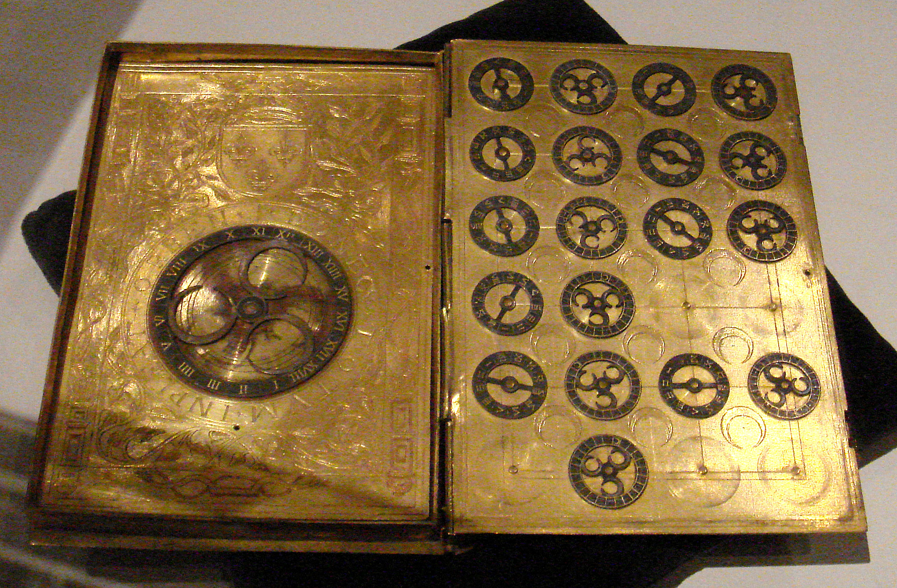

# A Very Short Introduction to Cryptography

Since ancient times, when people began to write, there has been a need to keep
some written text secret. By devising techniques to hide recorded information,
a new scientific field emerged – cryptography.

> **Cryptography** is a scientific discipline that deals with the development
> of systems for encrypting information. The word cryptography comes from the
> Greek words kryptós (*hidden, secret*) and graphein (*to write*).

In India, 2000-year-old writings speak of two types of encryption – the first
type was based on the substitution of letters based on their phonetic
relationships, and the second on a coded alphabet by pairing letters and using
reciprocal letters. In Persia, modern-day Iran, there were also two types of
encryption – the first royal script was used for official correspondence within
the kingdom, and the second for communication with other states.

The first book on cryptography, entitled "The Book of Cryptographic Messages"
according to historical sources, was written by the Arab philosopher Al-Khalil
(717–786), in which permutations and combinations are used for the first time
to list all Arabic words with and without vowels. However, classical encryption
methods often reveal statistical patterns about the original message, which can
be exploited to break the cipher.

After the discovery of frequency analysis of letters in a message, the Arab
mathematician Al-Kindi wrote the book "Manuscript for the Decipherment of
Cryptographic Messages" in the ninth century, in which the use of frequency
analysis techniques was first described.

> **Cryptanalysis** is the scientific discipline that studies methods for
> "breaking" cryptographic systems. The word cryptanalysis comes from the Greek
> words kryptós (*hidden, secret*) and analýein (*analysis*).

The first known treatise on cryptography was written in 25 pages by the Italian
architect Leone Battista Alberti in 1467. He is also the creator of the cipher
circle and other solutions for double-layered text concealment. Half a century
later, Johannes Trithemus' work on cryptography was published in five volumes.
In the 16th century, significant contributions were made by the Milanese doctor
Girolamo Cardano, the mathematician Battista Porta, and the French diplomat
Blaise de Vigenere.

In the 19th century, it was concluded that cryptography should not rely on the
secrecy of the encryption algorithms, but on the secrecy of the key. The
secrecy of the key itself must be sufficient to prevent the encrypted message
from being broken. This became one of the fundamental principles of
cryptography, written down in 1883 by Auguste Kerckhoffs (Kerckhoffs's
Principle). More explicitly, it was reiterated by Claude Shannon, the founder
of Information Theory and a key figure in theoretical cryptography, as
Shannon's Maxim: "the enemy knows the system".

During World War II, the Germans built a machine called the Enigma that
encrypted messages in a way never seen before. However, as revolutionary as it
was at the time, the Allies, led by Alan Turing, were able to break the Enigma
cryptographic system through cryptanalysis.

Cryptography and cryptanalysis are the two main disciplines of cryptology.

> **Cryptology** is the science that deals with various aspects of information
> security. The word cryptology comes from the Greek words kryptós (*hidden,
> secret*) and logos (*science*).

## Present

After World War II, with the development of information technology, cryptology
and its scientific disciplines became increasingly important. Modern computers
can break simple ciphers at incredible speeds, so cryptographic algorithms have
become much more advanced. Today, cryptography is generally divided into
**symmetric** encryption, where the same key is used for both encryption and
decryption...

...and **asymmetric** encryption, where a pair of public and private keys is
used:

Another essential tool is the cryptographic hash function, which creates a
unique digital fingerprint of data and is widely used in password protection,
digital signatures, and blockchain technology.

## The Future

Looking ahead, quantum cryptography is expected to become a foundation of
secure communication. It is based on the Heisenberg uncertainty principle of
quantum physics. However, quantum computing also poses a threat to many
cryptographic algorithms in use today, which has led to the development of
post-quantum cryptography.

The importance of cryptology in modern society cannot be overstated.
Cryptographic systems ensure the privacy of electronic communications,
enable secure e-commerce, protect cryptocurrencies, and in some countries
even safeguard electronic voting and vote counting.
